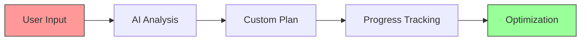

<!-- Animated Header -->

# Body-Forge 

_Your Personal AI-Powered Fitness Companion_

## 🌟 Overview

Body-Forge revolutionizes your fitness journey by combining cutting-edge AI with personalized workout planning. Whether you're a beginner or a seasoned athlete, our platform adapts to your needs, helping you forge your path to better health.

## ✨ Features

| Core Feature | Description |
|--------------|-------------|
| 🤖 **AI Workout Generation** | Custom workouts based on your goals and preferences |
| 📊 **Health Metrics** | Comprehensive tracking of calories, steps, and progress |
| 🥗 **Smart Recipe AI** | Personalized meal plans with nutritional insights |
| 📝 **Workout Logger** | Detailed exercise tracking with progress visualization |
| 📈 **Progress Analytics** | 7-day performance tracking with smart insights |
| 🔐 **Secure Platform** | Enterprise-grade user authentication system |

## 🎯 Smart Features

### Workout Intelligence

### Health Metrics Dashboard

| Metric | Tracking | Visualization |
|--------|----------|---------------|
| 🔥 Calories | Daily & Weekly | Line Charts |
| 👣 Steps | Real-time | Progress Bars |
| 💪 Workouts | Historical | Heat Maps |
| 🥗 Nutrition | Meal-based | Pie Charts |

## 🛠️ Technology Stack

| Layer | Technologies |
|-------|--------------|
| **Frontend** |    |
| **Backend** |   |
| **Database** |  |
| **APIs** |   |

## 🔮 Future Roadmap

| Feature | Status | Description |
|---------|---------|-------------|
| 🎯 AI Form Correction | Planning | Real-time exercise form feedback |
| 🤝 Social Challenges | In Progress | Community fitness challenges |
| 📱 Mobile App | Planning | Native mobile experience |
| 🧠 Smart Recommendations | In Progress | AI-powered workout adjustments |
| 🌐 Trainer Marketplace | Planning | Connect with fitness professionals |

